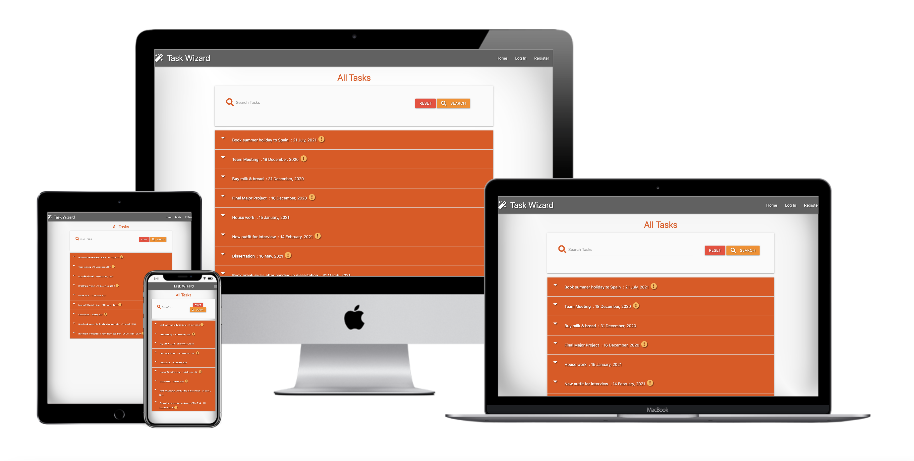

# 🪄TASK WIZARD

**Code Institute - Data Centric Development Milestone Project**

A task manager website utilising CRUD (Create, Read, Update & Delete) functionality.

Designed to be responsive and accessible on a range of devices, making it easy to navigate for potential users. Creating an easy, short and informative based site. Whist striving for a minimalist and user-friendly design, to encourage a positive UX.

## Demo
A live demo can be found [here](https://flask-task-wizard.herokuapp.com/).

<h2 align="center"></h2>

## User Experience (UX)

-   ### User stories

    -   ### Visitor Goals

        1. As a user, I want to easily understand the main purpose of the site and learn more about the destination Santorini.
        2. As a user, I want to be able to easily navigate throughout the site to find content.
        3. As a user, I want to look for information relevant to Santorini that could help aid a prospective visitor/traveller to the island. Both in the form of recommendations and other dedicated Santorini travel sites, in the social media links.
	
    -   ### Design
    -   #### Colour Scheme
        -   The three main colours used are black, white and [Greek flag] blue, in the footer social links. Keeping the colour scheme simple, yet effective.
    -   #### Typography
        -   I opted to use the default Bootstrap font Apple System, due to it’s clean font style, which fitted in with the aesthetic I wanted for the website.
    -   #### Imagery
        -   Strong imagery has been proven to help engage the user. Enticing images were used in the map's info windows, to help with a positive UX.

*   ### Wireframes & Database Schema

    -   Desktop Wireframe (Home/Tasks page) - [View](https://github.com/anronuay/MS3-task_wizard/blob/master/wireframes/bw-desktop.wireframe-home:tasks.page.png)
    -   Desktop Wireframe (Register/Log In page) - [View](https://github.com/anronuay/MS3-task_wizard/blob/master/wireframes/bw-desktop.wireframe-register:login.page.png)
    -   Desktop Wireframe (Profile page) - [View](https://github.com/anronuay/MS3-task_wizard/blob/master/wireframes/bw-desktop.wireframe-profile.page.png)
    -   Desktop Wireframe (Add/Edit tasks page) - [View](https://github.com/anronuay/MS3-task_wizard/blob/master/wireframes/bw-desktop.wireframe-add:edit.task.page.png)
    -   Desktop Wireframe (Admin/Categories page) - [View](https://github.com/anronuay/MS3-task_wizard/blob/master/wireframes/bw-desktop.wireframe-admin:categories.page.png)
    
    -   Tablet Wireframe (Home/Tasks page) - [View](https://github.com/anronuay/MS3-task_wizard/blob/master/wireframes/bw-tablet.wireframe-home:tasks.page.png)
    -   Tablet Wireframe (Register/Log In page) - [View](https://github.com/anronuay/MS3-task_wizard/blob/master/wireframes/bw-tablet.wireframe-register:login.page.png)
    -   Tablet Wireframe (Profile page) - [View](https://github.com/anronuay/MS3-task_wizard/blob/master/wireframes/bw-tablet.wireframe-profile.page.png)
    -   Tablet Wireframe (Add/Edit tasks page) - [View](https://github.com/anronuay/MS3-task_wizard/blob/master/wireframes/bw-tablet.wireframe-add:edit.task.page.png)
    -   Tablet Wireframe (Admin/Categories page) - [View](https://github.com/anronuay/MS3-task_wizard/blob/master/wireframes/bw-tablet.wireframe-admin:categories.page.png)
    			
    -   Mobile Wireframe (Home/Tasks, Register/Log In & Profile pages) - [View](https://github.com/anronuay/MS3-task_wizard/blob/master/wireframes/bw-smartphone.wireframe-home:tasks:register:login:profile.page.png)
    -   Mobile Wireframe (Add/Edit & Admin/Categories pages) - [View](https://github.com/anronuay/MS3-task_wizard/blob/master/wireframes/bw-smartphone.wireframe-add:edit:admin:categories.page.png)
    
    -   Database Schema for Task Wizard - [View](https://github.com/anronuay/MS3-task_wizard/blob/master/static/images/database.schema-task.wizard.pdf)

## Features

### Existing Features

-   Responsive on all device sizes.
-   Interactive elements.
-   Google Maps API - Using JavaScript Maps API, recommended custom markers are listed to the inbuilt map.
- Places Search Box - Using Places API, allows the user to search for other places of interest listed within the Country of Greece on Google.

### Future Features

- Show user location on the map, using their GPS. Thus allowing the user to compare their location to the recommendations [directions etc].
- Expand the website to include more destinations, on the neighbouring islands within Greece.
- Expand with more categories for the customised markers.

### 

## Technologies Used

### Languages Used

-   [HTML5](https://en.wikipedia.org/wiki/HTML5)
-   [CSS3](https://en.wikipedia.org/wiki/Cascading_Style_Sheets)
-   [JavaScript](https://en.wikipedia.org/wiki/JavaScript)
-   [Python](https://en.wikipedia.org/wiki/Python_(programming_language))

### Frameworks, Libraries & Programs Used

1. [Materialize 1.0.0:](https://materializecss.com/getting-started.html)
    - Materialize was used to assist with the responsiveness and styling of the website.
1. [Font Awesome:](https://fontawesome.com/)
    - Font Awesome was used throughout the website to add icons for aesthetic and UX purposes.
1. [jQuery:](https://jquery.com/)
    - jQuery - JavaScript library.
1. [Flask:](https://flask.palletsprojects.com/en/1.1.x/)
    - Flask is a micro web framework written in Python.
1. [MongoDB:](https://www.mongodb.com/)
    - MongoDB is a cross-platform document-oriented database program. 
1. [Jinja:](https://jinja.palletsprojects.com/en/2.11.x/)
    - Jinja is a modern and designer-friendly templating language for Python, modelled after Django’s templates.
1. [PyMongo:](https://pypi.org/project/pymongo/)
    - PyMongo is a Python distribution containing tools for working with MongoDB, and is the recommended way to work with MongoDB from Python.
1. [Werkzeug:](https://pypi.org/project/Werkzeug/)
    - Werkzeug is a comprehensive WSGI web application library.
1. [Heroku:](https://www.heroku.com/)
    - Heroku is a cloud platform as a service supporting several programming languages. 
1. [Git](https://git-scm.com/)
    - Git was used for version control by utilising the Gitpod terminal to commit to Git and Push to GitHub.
1. [GitHub:](https://github.com/)
    - GitHub is used to store the projects code after being pushed from Git.
1. [Balsamiq:](https://balsamiq.com/)
    - Balsamiq was used to create the [wireframes](https://github.com/anronuay/MS3-task_wizard/tree/master/wireframes) during the design process.
1. [WebAIM:](https://webaim.org/resources/contrastchecker/)
    - Contrast checker, relevant in terms of accessibility and UX design.
1. [Favicon.io:](https://favicon.io/)
    - Free shortcut icon, website icon, tab icon, URL icon, or bookmark icon, associated with a particular website or web page.

## Testing

The W3C Markup Validator and W3C CSS Validator Services were used to validate every page of the project to ensure there were no syntax errors in the project. Along with JS Hint to ensure there were no linting issues with my JavaScript and PEP 8 compliant Python code.

-   [W3C Markup Validator](https://validator.w3.org/#validate_by_input) - Only errors received, were relating to the Jinja syntax.
-   [W3C CSS Validator](https://jigsaw.w3.org/css-validator/#validate_by_input) - [Results](https://github.com/anronuay/MS3-task_wizard/blob/master/static/images/w3c-css.validator.png)
-   [JS Hint Version 2.12.0](https://jshint.com/)
-   [PEP8 online](http://pep8online.com/) - [Results]()

### Testing User Stories from User Experience (UX) Section

-   #### User Stories

    1. As a user, I want to easily understand the main purpose of the site and learn more about the destination Santorini.

        1. Upon entering the site, users are automatically greeted with a clean and easily readable header, with the text 'Explore Santorini'. Underneath there is a small paragraph outlining the intention, recommendations for the island of Santorini, Greece. 
        2. A map of Santorini, Greece is presented below the text to allow the user to engage with the map, search bar, marker icons and info window boxes.

    2. As a user, I want to be able to easily navigate throughout the site to find content.

        1. The website was designed with the intention to be easy, simple to use and the content to be pretty self explanatory.
        2. Interactively via the map, three categories under the headings of attractions, restaurants and places to stay. Clearly displayed and marked under different universal logo/images and colour coded, with info window boxes displaying images of said recommendations and a link to learn more.

    3. As a user, I want to look for information relevant to Santorini that could help aid a prospective visitor/traveller to the island. Both in the form of recommendations and other dedicated Santorini travel sites, in the social media links.

        1. The integrated search bar embedded in the map section allows the user to search for other related destinations [attractions, restaurants & hotels], within Santorini and Greece.
        2. The social media links in the footer, reinforces additional content and information for Santorini, allowing the user to broaden their knowledge about the island.

### Further Testing

-   The Website was tested on Google Chrome and Safari browsers.
-   The website was viewed on a variety of devices such as Desktop, Laptop, iPad, iPhone 5SE, Samsung Galaxy S10 and all mobile device options provided by Google Chrome DevTools.
-   A large amount of testing was done to ensure that all pages were linking correctly.
-   Friends and family members were asked to review the site and documentation to point out any bugs and/or user experience issues.

### Manual Testing

Using the Bootstrap layout and mobile fist development method, it allowed me to create a responsive website. All of the content resizes appropriately within the size of the displayed screen. This was tested using Google Chrome DevTools, allowing me to use the responsive feature and set mobile devices, to resize the screen and see how the website responded to different device screen sizes. 

1. Map:
    1. Map loads centred on Santorini, Greece.
    2. Customised marker icons, image and colour coded to allow easability and functionality for the user.
    3. Info windows appear, one at a time, when the user clicks on the relevant marker.
    4. Additional information is provided with a link, to learn more about said recommendation. Reinforced with a strong image of the destination.
    5. Search bar enables the user to search for further destinations within Santorini and Greece.
    6. Drop down list which includes both places and predicted search terms.
    7. Once selected, a red marker highlights said destination and pins it to the centre of the map.
    8. Included functionally provided within Google Maps, scrolling function, with toggle fullscreen view, Google logo [opens new window, within Google Maps], drag pegman on to the map to open street view and zoom in & zoom out buttons. 
    9. No console errors detected.
    
2. Social Links:
    1. Social link icons load correctly at the footer of the website.
    2. Simple black social link icons, to fit in with the rest of the page. Hover colour chosen was blue from the Greek flag.
    3. Once the user clicks on the relevant icon, a new tab opens displaying said content.
    4. Either Facebook, Twitter, Instagram or YouTube.
    5. All social links are dedicated Santorini travel websites. 
    6. No console errors detected.

### Known Bugs

-   Places Search Box - When the user searches for a place and selects from the predicted search terms and either clicks with their mouse or selects via touch screen on mobile devices. The map will seem unresponsive. However when prompted again it works as intended. 

- When the same process is ended with the user pressing the enter button to action, or selecting via the keyboard arrows, the website is responsive, as intended. After following this query up with Code Institute's Tutor Support team, they informed me that they had not encountered this issue before. After checking through the JavaScript, they concluded that it was a glitch within Google Maps.

## Deployment

### GitHub Pages

The project was deployed to GitHub Pages using the following steps...

1. Log in to GitHub and locate the [GitHub Repository](https://github.com/).
2. At the top of the Repository (not top of page), locate the "Settings" Button on the menu.
3. Scroll down the Settings page until you locate the "GitHub Pages" Section.
4. Under "Source", click the dropdown called "None" and select "Master Branch".
5. The page will automatically refresh.
6. Scroll back down through the page to locate the now published site [link](https://github.com) in the "GitHub Pages" section.

### Forking the GitHub Repository

By forking the GitHub Repository we make a copy of the original repository on our GitHub account to view and/or make changes without affecting the original repository by using the following steps...

1. Log in to GitHub and locate the [GitHub Repository](https://github.com/).
2. At the top of the Repository (not top of page) just above the "Settings" Button on the menu, locate the "Fork" Button.
3. You should now have a copy of the original repository in your GitHub account.

### Making a Local Clone

1. Log in to GitHub and locate the [GitHub Repository](https://github.com/).
2. Under the repository name, click "Clone or download".
3. To clone the repository using HTTPS, under "Clone with HTTPS", copy the link.
4. Open Git Bash
5. Change the current working directory to the location where you want the cloned directory to be made.
6. Type `git clone`, and then paste the URL you copied in Step 3.

```
$ git clone https://github.com/YOUR-USERNAME/YOUR-REPOSITORY
```

7. Press Enter. Your local clone will be created.

```
$ git clone https://github.com/YOUR-USERNAME/YOUR-REPOSITORY
> Cloning into `CI-Clone`...
> remote: Counting objects: 10, done.
> remote: Compressing objects: 100% (8/8), done.
> remove: Total 10 (delta 1), reused 10 (delta 1)
> Unpacking objects: 100% (10/10), done.
```

## Credits

### Code

-   [W3Schools:](https://www.w3schools.com/) Online web tutorials used throughout, reinforcing my knowledge acquired through the course.
-   [Materialize 1.0.0:](https://materializecss.com/getting-started.html) A modern responsive front-end framework based on Material Design.
-   [Mike Dane:](https://www.youtube.com/channel/UCvmINlrza7JHB1zkIOuXEbw) YouTube Python & MongoDB Tutorials.
-   [freeCodeCamp.org:](https://youtu.be/Z1RJmh_OqeA) YouTube 'Learn Flask for Python - Full Tutorial'.
-   [Stack Overflow:](https://stackoverflow.com/) Public platform is used by nearly everyone who codes, to learn, share their knowledge and collaborate.
-   Code Institute: Reference from Code Institute's Data Centric Development module.


### Content

-   All content was written by the developer, unless stated otherwise.

### Acknowledgements

-   Code Institute's Tutor support team, my Mentor and the Slack community.

**This is for educational use.**
